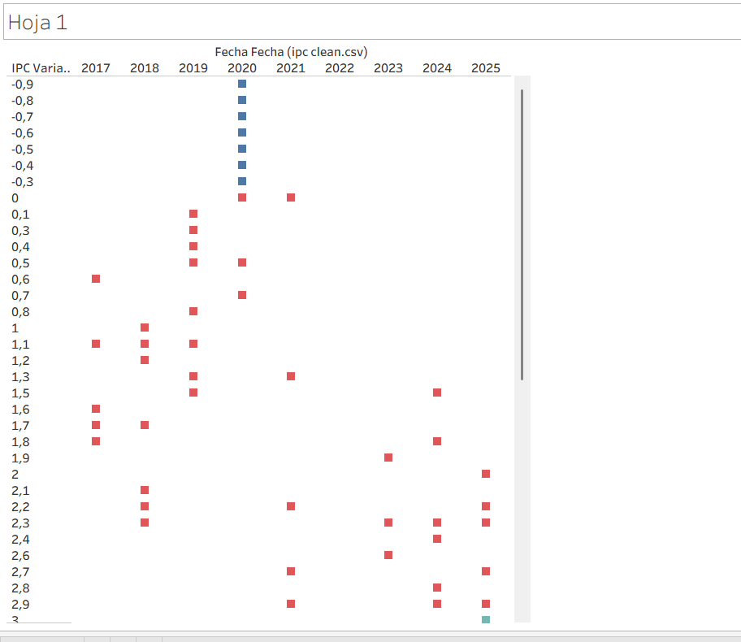
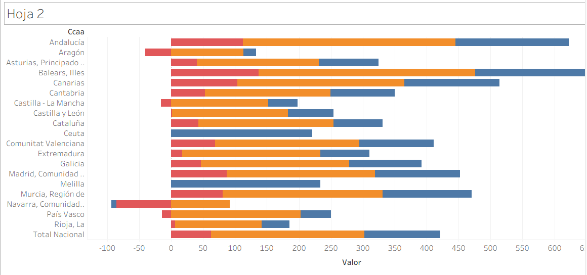
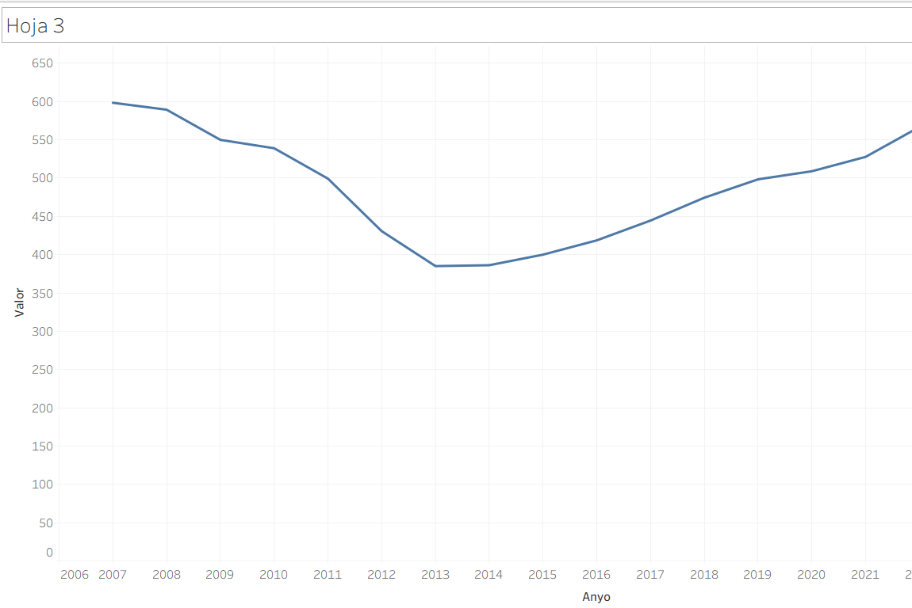
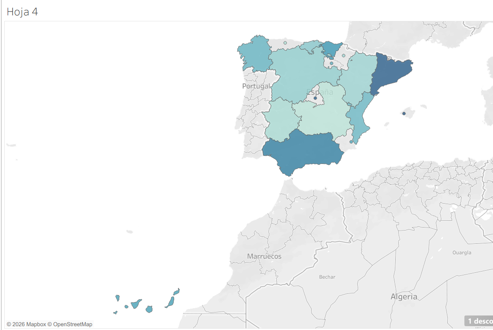
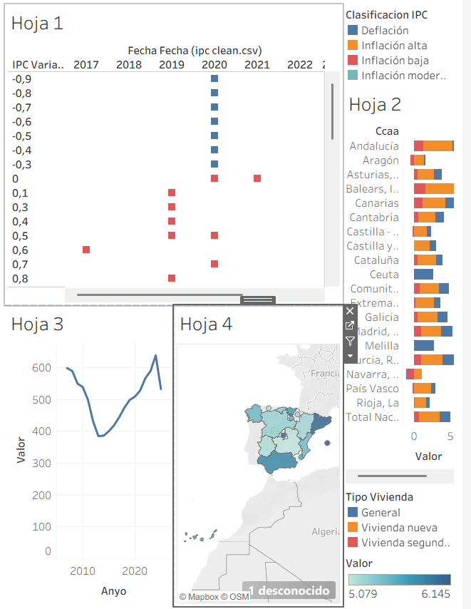
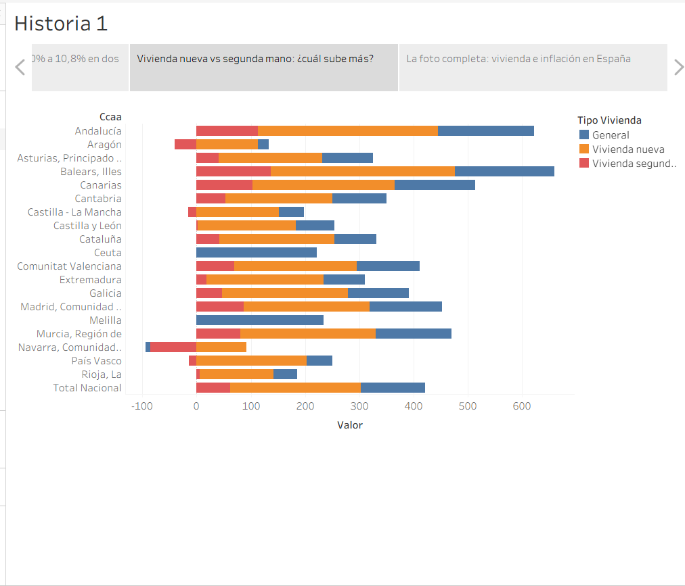

### Extracción y filtrado de datos del INE en DataFrame
Este script de Python permite obtener datos desde la API del Instituto Nacional de Estadística (INE) de España y filtrarlos fácilmente según las columnas indicadas, facilitando el análisis posterior en pandas.

### Descripción
El archivo contiene la función obtener_datos, diseñada para acceder a distintos endpoints de la API del INE y devolver los datos en un DataFrame de pandas, ya filtrados por las columnas que el usuario especifique. La función soporta tanto endpoints del tipo DATOS_TABLA (listas de series) como DATOS_SERIE (serie individual con sus datos).

### Requisitos
**Antes de ejecutar el script, asegúrate de tener instaladas las siguientes dependencias:**

 - **Python 3.x** --> Cualquier versión de python de 3.x en adelante recomendada 3.13.8

 - **Un gestor de base de datos** --> Sirve cualquiera que admita MySQL por ejemplo MySQL Workbench, HeidiSQL, etc 

###### LIBRERIAS EXTERNAS:

 - **pandas** → Permite manipular y analizar datos de manera eficiente usando estructuras como DataFrame y Series. Ideal para procesamiento de datos tabulares, limpieza, filtrado y exportación a CSV/Excel.

 - **requests** → Facilita hacer peticiones HTTP (GET, POST, etc.) de forma sencilla. Muy útil para APIs, scraping y descarga de datos de internet.

 - **mysql** → Permite conectarse y operar sobre bases de datos MySQL desde Python. Generalmente se usa mysql-connector-python o PyMySQL.

 - **numpy** → Librería para cálculo numérico y matrices de manera rápida. Fundamental para operaciones matemáticas, estadísticas y procesamiento de arrays grandes.

###### PUEDES INSTALAR DEPENDENCIAS ASÍ:

 - Acedes al CMD/bash
   
 - Ejecutas: **pip install pandas requests mysql numpy**

  **Otra Opción:** (Tienes que tener instalado "uv") uv add pandas requests mysql numpy
   
**De esta forma lo instalas en Python global**, si no quieres de esta manera puedes usar un entorno virtual y instalarlas ahí.

 - Acedes al CMD/bash
   
 - Ejecutas (como recomendación hacerlo con uv es mas rápido): uv venv
   
 - Ejecutas: .venv\Script\activate

 **Peligro:** Algunas veces no viene con pip instalado, si ese es el caso usa ejecuta esto: python -m ensurepip
   
 - Ejecutas: python -m pip install pandas requests mysql numpy
   
### Uso
El uso principal se realiza mediante los archivos de datos_*.py. Se recogen datos del INE y se meten en una base de datos MySQL.

**Aclaración:** El archivo Consulta.sql crea la base de datos y las tablas necesarias.

## Flujo de Trabajo con Git

Para cumplir con el objetivo de trabajo colaborativo, se seguirá un flujo de trabajo básico con Git:

1. No hacer `commit` directamente a la rama `main` (o `master`).
2. Crear **ramas** (`feature/`, `fix/`) para cada nueva funcionalidad o script (ej. `feature/api-openweather`).
3. Realizar **Pull Requests (PRs)** para integrar los cambios en `main`.

---

## Práctica 1.8 - Data Preparation con Polars y Plotly

### Descripción

Esta práctica extiende el trabajo de la 1.7, implementando la fase de **Data Preparation** utilizando:
- **Polars**: Librería de alto rendimiento (escrita en Rust) para procesamiento de datos
- **Plotly**: Visualizaciones interactivas para análisis exploratorio

### Proceso de Transformación

El script `main_analysis.py` realiza:

1. **Conexión y Extracción**: Conecta a MySQL y carga datos de IPC (Índice de Precios al Consumo) e IPV (Índice de Precios de Vivienda) en DataFrames de Polars
2. **Limpieza de Datos**:
   - Conversión de tipos (Decimal → Float, String → Int)
   - Tratamiento de valores nulos
   - Creación de columnas calculadas
3. **Transformaciones**:
   - **Variación interanual**: `((valor_actual - valor_anterior) / valor_anterior) * 100`
   - **Ratio IPV/IPC**: Indicador de poder adquisitivo en vivienda
   - **Agregaciones por año**: Promedios anuales para comparativa
4. **Exportación**: 4 datasets CSV en `data_output/`
5. **Visualización**: 3 gráficos HTML interactivos en `visualizations/`

### Datasets Generados

| Archivo | Descripción |
|---------|-------------|
| `Evolucion_IPC.csv` | Serie temporal del IPC con variaciones interanuales |
| `Evolucion_IPV.csv` | Serie temporal del IPV con variaciones interanuales |
| `Comparativa_IPC_IPV.csv` | Datos combinados por año con ratio IPV/IPC |
| `Variaciones_Interanuales.csv` | Cambios porcentuales año a año |

### Visualizaciones

| Gráfico | Descripción |
|---------|-------------|
| `evolucion_temporal.html` | Líneas interactivas mostrando evolución de IPC e IPV |
| `correlacion_ipc_ipv.html` | Scatter plot de correlación entre ambos índices |
| `mapa_ipc_ccaa.html` | Mapa coroplético del IPC (variación anual) por Comunidad Autónoma |

### Conclusiones del Análisis

1. **Relación IPC-IPV**: Existe una correlación entre ambos índices, aunque el IPV muestra mayor volatilidad debido a factores específicos del mercado inmobiliario.

2. **Evolución temporal**: Ambos índices muestran tendencias similares en periodos de estabilidad económica, pero divergen significativamente en periodos de crisis (ej. burbuja inmobiliaria 2007-2008).

3. **Ratio IPV/IPC**: Este indicador es útil para evaluar si la vivienda se encarece más rápido que el coste de vida general. Valores > 1 indican que la vivienda sube proporcionalmente más que la inflación general.

### Ejecución

```bash
# Instalar dependencias
pip install -r proyecto1.7/requirements.txt

# Ejecutar análisis (requiere MySQL con datos cargados)
python proyecto1.7/main_analysis.py
```

### Dependencias Adicionales (Práctica 1.8)

- **polars** → Procesamiento de datos de alto rendimiento
- **plotly** → Visualizaciones interactivas
- **pyarrow** → Conversión entre Polars y Pandas

## 📊 Tableau — Explotación de Datos

### Fuentes de datos
| Fuente | Tipo | Descripción |
|---|---|---|
| `ipc_clean.csv` | CSV (Polars) | Variación anual IPC nacional mensual (2017–2025) |
| `ipv_clean.csv` | CSV (Polars) | Índice de Precios de Vivienda por CCAA trimestral (2007–2024) |
| Base de datos | MySQL/SQLite | Tablas originales del INE |

Fuentes relacionadas por el campo `Anyo` mediante **Data Blending** de Tableau.

---

### Campos calculados
- **Clasificacion IPC**: categoriza la inflación en 4 niveles (`Inflación alta/moderada/baja/Deflación`) mediante lógica IF/ELSEIF

---

### Visualizaciones

**Hoja 1 — IPC mensual (2017–2025)**
Línea temporal con pico histórico del 10,8% en julio 2022.


**Hoja 2 — Vivienda nueva vs Segunda mano por CCAA**
Barras comparativas por tipo de vivienda en 2024.


**Hoja 3 — IPV Nacional (2007–2024)**
Burbuja inmobiliaria, caída del ~40% en la crisis y recuperación posterior.


**Hoja 4 — Mapa IPC Nacional (2017–2024)**
Mapa de IPC desde 2017 hasta 2024.


**Dashboard interactivo**
Las tres hojas combinadas con acciones de filtro cruzado entre gráficos.


---

### Historia
Narrativa de 4 puntos: burbuja inmobiliaria → pico de inflación 2022 → comparativa vivienda 2024 → visión global.


---

### Archivo Tableau
Disponible en `/tableau/3.2 Jorge_Castillo_Gordillo.twbx`

---

## 🤖 Predictive Modeling — IPC → IPV Regression

### Objective

Predict whether an increase in the Consumer Price Index (**IPC**) correlates with an increase in the Housing Price Index (**IPV**) using regression models. This transitions the project from descriptive analysis (*what happened?*) to predictive analysis (*what will happen?*).

### Algorithm Selection Rationale

**Paradigm chosen: Regression** — since both IPC and IPV are continuous numerical variables (annual percentage variations), the problem naturally falls into a regression framework. We want to predict a numerical value (IPV variation) from another numerical value (IPC variation).

We compare **four regression models** to ensure the best possible fit:

| Model | Why included |
|---|---|
| **Linear Regression** | Baseline — simplest model, captures linear relationships |
| **Ridge Regression** | L2 regularisation — prevents overfitting when features are correlated |
| **Lasso Regression** | L1 regularisation — can zero out irrelevant features, useful for feature selection |
| **Polynomial (degree 2)** | Captures non-linear (quadratic) relationships between IPC and IPV |

Ridge and Lasso were preferred over more complex models (Random Forest, SVR) because the dataset has **few features** (primarily IPC variation) and **limited observations** (~60-80 quarters). Simple regularised models avoid overfitting while remaining interpretable.

### Feature Engineering

| Transformation | Rationale |
|---|---|
| **Quarterly aggregation** | Monthly IPC is averaged into quarterly values to match IPV's quarterly frequency |
| **StandardScaler** | Zero-mean, unit-variance normalisation. Required for Ridge/Lasso so the regularisation penalty treats all features equally. Also makes coefficients directly comparable across models |
| **Quarter extraction** | Temporal alignment feature derived from date to enable IPC-IPV cross-join |

### Hyperparameter Tuning

- **Method**: `GridSearchCV` with 5-fold cross-validation
- **Tuned parameter**: `alpha` (regularisation strength) for Ridge and Lasso
- **Search space**: `[0.001, 0.01, 0.1, 1.0, 10.0, 100.0]`
- **Scoring metric**: R² (coefficient of determination)

Higher alpha = stronger regularisation = simpler model (less prone to overfitting but potentially worse fit).

### Validation & Overfitting Analysis

The validation strategy ensures model reliability:

1. **Train/Test Split** (80/20): Held-out test set provides unbiased performance estimate
2. **5-Fold Cross-Validation**: Reports mean R² ± standard deviation across folds
3. **Overfitting Detection**: Train R² vs Test R² gap — a gap > 0.2 triggers a warning

**Metrics reported for every model**:

| Metric | What it measures |
|---|---|
| **R² (train & test)** | Proportion of variance explained — closer to 1 is better |
| **RMSE** | Root Mean Squared Error — in same units as IPV (%), penalises large errors |
| **MAE** | Mean Absolute Error — average error magnitude in % |
| **CV R² ± std** | Cross-validated R² — most robust performance estimate |

### Three Regression Models

**Model 1 — National Spain**: Single regression at national level. IPC (general) → IPV (general). Provides the baseline relationship between inflation and housing prices.

**Model 2 — By Autonomous Community (CCAA)**: Independent regressions for each of Spain's 17 CCAA. Reveals regional differences — some communities (e.g., Madrid, Cataluña) show stronger IPC-IPV coupling than others.

**Model 3 — By Housing Type**: Separate regressions for general, new-build, and second-hand housing at national level. New-build housing typically shows higher sensitivity to IPC changes.

### Visualisations

| Chart | File | Description |
|---|---|---|
| National scatter + regression line | `regresion_general_espana.html` | Scatter plot with best model regression line, coloured by year |
| CCAA faceted scatter | `regresion_por_ccaa.html` | Top 9 CCAA by R², each with OLS trendline |
| CCAA R² ranking | `regresion_r2_por_ccaa.html` | Horizontal bar chart ranking all CCAA by R² |
| Housing type comparison | `regresion_tipo_vivienda.html` | Three regression lines overlaid (general, new, second-hand) |

### Conclusions

1. **IPC-IPV Relationship**: There is a positive correlation between consumer inflation and housing prices — when IPC increases, IPV tends to follow, though the strength varies by region and housing type.

2. **Regional Variation**: CCAA with stronger real estate markets (coastal and metropolitan areas) typically show higher R² values, indicating that housing prices in these regions are more sensitive to general inflation.

3. **Housing Type**: Second-hand housing generally shows higher responsiveness to IPC changes compared to new-build, likely because new-build prices incorporate additional supply-side factors (construction costs, land availability).

4. **Model Performance**: Regularised models (Ridge/Lasso) often match or outperform basic linear regression, demonstrating the value of hyperparameter tuning even in simple regression tasks.

### Execution

```bash
# Install dependencies
pip install -r proyecto1.7/requirements.txt

# Run regression analysis (requires CSVs in data_output/)
python proyecto1.7/regression_analysis.py
```

Output: 4 interactive HTML charts in `visualizations/`.

